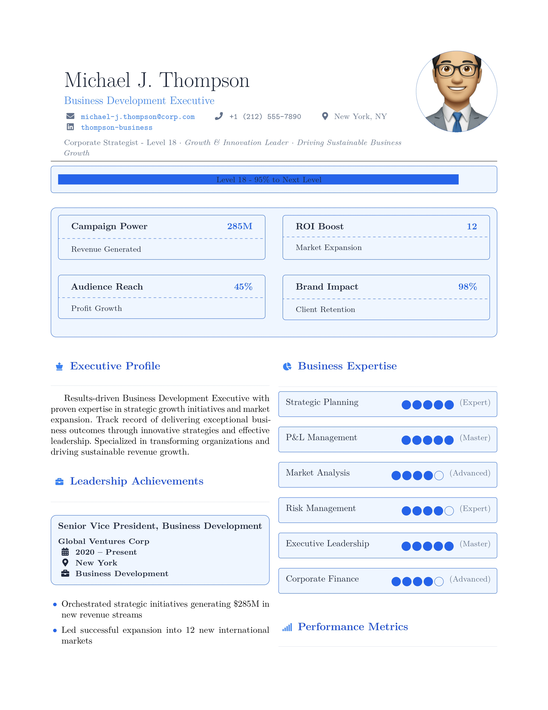
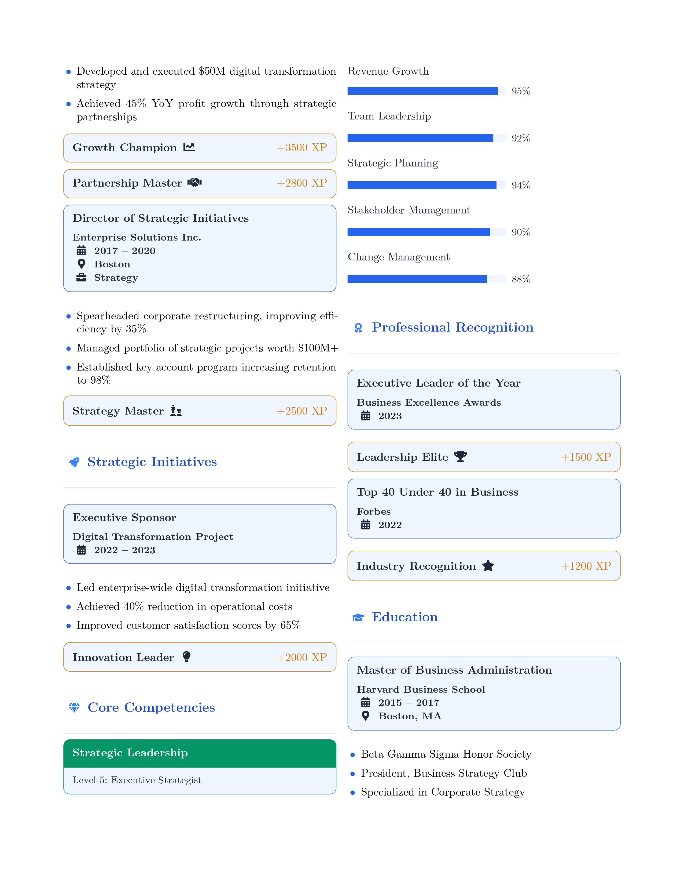
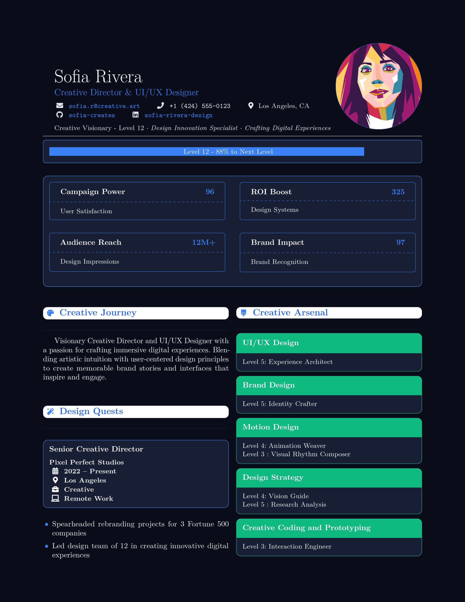
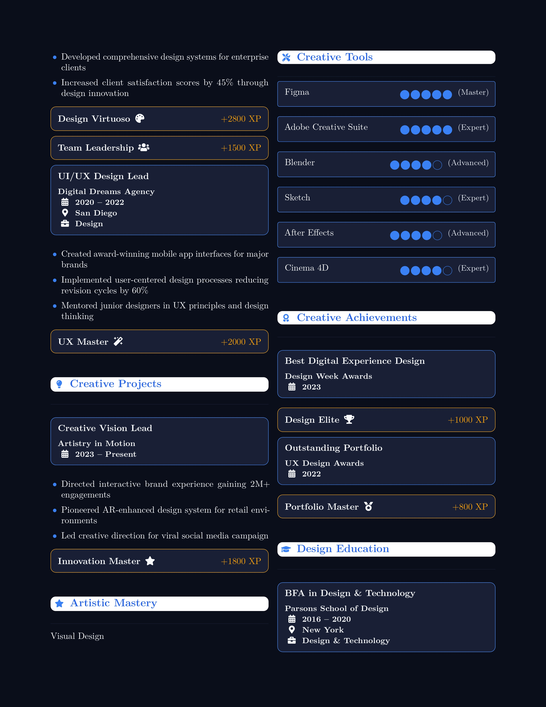

# 🎮 Gamified LaTeX CV Template

Stand out with a professionally gamified CV/Resume template that combines creativity with professionalism.

## 📸 Preview

### Light Theme
<table>
<tr>
<td width="50%">

</td>
<td width="50%">

</td>
</tr>
</table>

### Dark Theme
<table>
<tr>
<td width="50%">

</td>
<td width="50%">

</td>
</tr>
</table>

[📄 View PDF Example](assets/darkVersion.pdf)

## ✨ Features

- 🎨 Multiple theme options (classic, ocean, nature, sunset, royal)
- 🌓 Dark mode support
- 🎯 Gamification elements (XP bars, achievements, skill trees)
- 📱 Responsive design
- ♿ Accessibility features
- 🤖 ATS-friendly structure
- 🔧 Easy customization
- 📊 Professional typography and layout

## 🚀 Quick Start

1. Fork this repository
2. Open in Overleaf (easy method):
   - Create new project
   - Upload the template files
   - Start customizing!

## 📝 Basic Usage

```latex
\documentclass[theme-classic]{gamifiedcv}

\begin{document}
% Your info
\name{YOUR NAME}
\jobtitle{Your Job Title}
\level{Your Level}
...

% Make the header
\makeheader

% Add your content
...

\end{document}
```

## 🎨 Available Themes

- Classic (Blue/Purple)
- Ocean (Cyan/Blue)
- Nature (Green/Teal)
- Sunset (Orange/Rose)
- Royal (Purple/Indigo)

## 💡 Pro Version

For full features and premium support, check out the [pro version on Etsy](https://www.etsy.com/listing/1858429103/professional-gamified-latex-resume).

Pro version includes:
- Additional themes
- Premium support
- Regular updates
- Advanced gamification elements
- Priority bug fixes
- More customization options

## 📄 License

This basic version is released under the MIT License. See [LICENSE](LICENSE) for more details.

## 🤝 Contributing

Contributions are welcome! Please feel free to submit a Pull Request.

## 📫 Support

- For basic version issues: Open a GitHub issue
- For pro version support: [Contact through Etsy](https://www.etsy.com/listing/1858429103/professional-gamified-latex-resume)

## 🌟 Show Your Support

If you find this template helpful, please give it a star! It helps others discover the project.